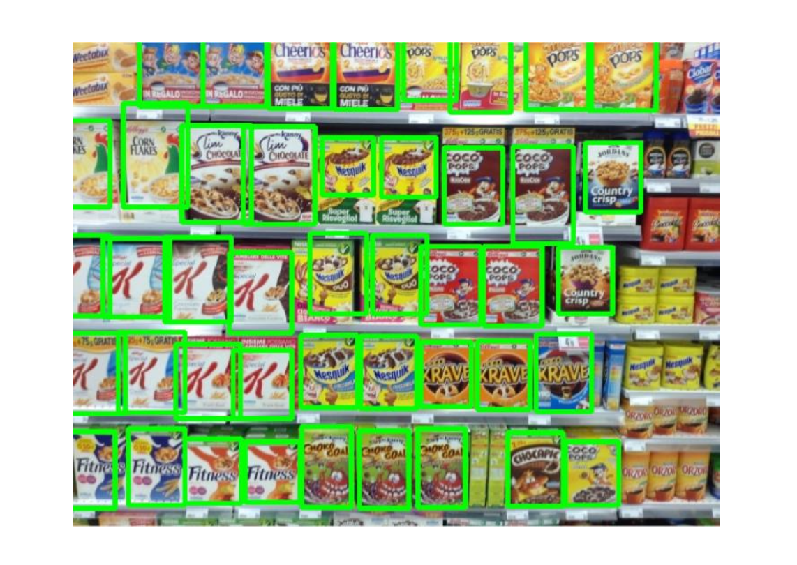

# Object Recognition on Store Shelves Project: 

This project focuses on developing object detection systems to identify single and multiple instances of products in given scene images. 

The project is divided into two main steps:

## Step A - Multiple Product Detection

The objective of this step is to develop an object detection system to identify single instances of products in a scene image. The approach involves:

1. **Loading and Preprocessing**: Load the reference product images and scene images, and apply preprocessing techniques like histogram equalization and sharpening to enhance the scene images.
2. **Feature Extraction**: Compute SIFT (Scale-Invariant Feature Transform) keypoints and descriptors for both the product and scene images.
3. **Matching**: Use the FLANN (Fast Library for Approximate Nearest Neighbors) algorithm to match keypoints between the product and scene images.
4. **Homography Estimation**: Compute the homography matrix based on the matched keypoints to estimate the bounding box of the product instance in the scene.
5. **Rectangularity Check**: Perform a rectangularity check on the estimated bounding boxes to filter out incorrect matches.

## Step B - Multiple Instance Detection

The objective of this step is to develop an object detection system to identify multiple instances of products in a scene image. The approach utilizes the Generalized Hough Transform (GHT) combined with SIFT keypoints:

1. **Loading and Preprocessing**: Similar to Step A, load the product and scene images, and apply preprocessing techniques.
2. **Feature Extraction**: Compute SIFT keypoints and descriptors for both the product and scene images.
3. **Matching**: Use the FLANN algorithm to match keypoints between the product and scene images.
4. **GHT and Clustering**: Implement the online phase of the GHT algorithm to cast votes in an Accumulator Array (AA) and find clusters of points representing potential product instances. The DBSCAN clustering algorithm is applied to the non-zero entries of the AA matrix.
5. **Homography Estimation**: For each cluster, compute the homography matrix based on the matched keypoints to estimate the bounding box of the product instance in the scene.
6. **Rectangularity Check**: Perform a rectangularity check on the estimated bounding boxes to filter out incorrect matches.

## Project Structure

- `project.ipynb`: The Jupyter Notebook containing the Python code for both Step A and Step B.
- `models/`: Directory containing the reference product images.
- `scenes/`: Directory containing the scene images for different steps.

## Requirements

- Python 3.x
- OpenCV
- NumPy
- Matplotlib
- scikit-learn

## Usage

1. Clone the repository or download the project files.
2. Install the required dependencies.
3. Open the `project.ipynb` file in Jupyter Notebook.
4. Run the code cells to execute the object detection pipeline for Step A and Step B.
5. The results, including the detected product instances and their positions, will be displayed in the notebook.

## Credits

This project was developed by Alberico Arcangelo for the Image Processing and Computer Vision course at the University of Bologna.